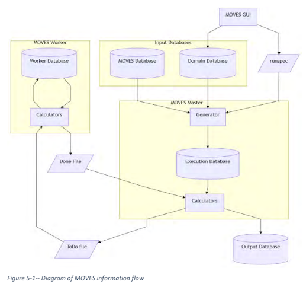

# Environmental Protection Agency (EPA) MOVES Model: MOtor Vehicle Emission Simulator

#### GEOS 518 Final Project

##### Tryston Sellers 12/13/2021  
\

(Updates to EPA’s Motor Vehicle Emission Simulator (MOVES) 2019)

***

## Table of Contents

1. [Introduction](#1.-Introduction)
    1. [Engineering Challenge](#1.A-Engineering-Challenge)
2. [Model Description](#2.-Model-Description)
    1. [Flow, Software & Databases](#2.A-Flow,-Software-&-Databases)
    2. [Methods of Calculations](#2.B-Methods-of-Calculations)
    3. [GEOS 518 Connections](#2.C-GEOS-518-Connections)
3. [Data Needs](#3.-Data-Needs)
    1. [Required Inputs & Outputs for RunSpec](#3.A-Required-Inputs-&-Outputs-for-RunSpec)
    2. [Example Output Data](#3.B-Example-Output-Data)
4. [Calibration](#4.-Calibration)
5. [Numerical Experiment Design](#5.-Numerical-Experiment-Design)
    1. [RunSpec: Input & Output Selections](#5.A-RunSpec:-Input-&-Output-Selections)
    2. [Experiment Calibration](#5.B-Experiment-Calibration)
    3. [Conclusion](#5.C-Conclusion)
6. [Reference List](#6.-Reference-List)

## 1. Introduction

***

MOVES is an emissions model developed by the U.S. Environmental Protection Agency that stands for MOtor Vehicle Emission Simulator. It was created to estimate air pollution emissions for air pollutants, greenhouse gases and air toxics. It was first released in 2010 for on road vehicles only and then in 2014 it was released to include the NONROAD model. There have been seven releases with the most recent in 2021 (United States. Environmental Protection Agency. Office of Transportation and Air Quality. Assessment and Standards Division, 2021). Each update improves the model and increases its scope. This model can be used for a number of different emission scenarios that are seen in the table below.

#### Table 1: Available MOVES Algorithms

| Onroad  | Nonroad |
| :---    | :----   |
|Running Exhaust| Running exhaust Permeation: Tank, Hose, Neck, Supply/Return & Vent Hose|
|Start Exhaust| Crankcase Exhaust|
|Hotelling Emissions| Refueling Displacement Vapor & Spillage Loss|
|Crankcase| Fuel Vapor Venting|
|Brakewear| Permeation: Tank, Hose, Neck, Supply/Return & Vent Hose|
|Tirewear| |
|Evaporative Permeation| |
|Evaporative Fuel Vapor Venting| |
|Evaporative Fuel Leaks| |
|Refueling Displacement Vapor and Spillage Loss| |

These emission scenarios allow users to estimate the environmental impact certain types of vehicles have, a new restaurant would have or a prediction scenario based on population growth. The opportunities are endless for what MOVES can be used for. Specifically the challenge I will discuss is idling emissions.

### 1.A Engineering Challenge

It is common knowledge that idling emissions are more harmful to the environment than emissions from free-flowing traffic because of the engine's efficiency. MOVES can be used to estimate the total emissions from a drive-through. A study has actually already used MOVES to compare various drive-through configurations (Hill & Qiao, 2016). Their hypothesis was that different configurations would have an effect on the amount of emissions at each drive-through. They used MOVES to gather emission factors for vehicles in three different drive-throughs and then compared the results. This study led to the development of my own research question for my thesis which is: What is the contribution to mobile emissions from drive-throughs in comparison to freeway traffic? The engineering challenge I am looking at is less about the actual drive-through configurations and more about the overall contribution drive-throughs make to air pollution in a big city such as Boise, ID. 

## 2. Model Description

***

### 2.A Flow, Software & Databases

MOVES is written in Java, MariaDB and Go programming with the Nonroad code in Fortran. The model is available to the public on the USEPA github page in the EPA_MOVES_MODEL repository. The model itself uses a graphical user interface (GUI) that controls the run specification (RunSpec) and an error-checking code to ensure that the code is run successfully. Then there is a master program that pulls from the RunSpec and databases to create ToDo files that are sent to the MOVES worker. The worker then completes the tasks and returns Done files to the master which then compiles them into an output database. There are a total of five databases: one for the outputs and worker, an execution one, a default, and a user input one. The default database is included in the MOVES installation package and has required emission factors, adjustment factors, fuel data, and default vehicle populations for years 1990 and 1999 through 2060. The user input database is mostly used for smaller scale projects that require more specific data for vehicle populations, region-specific fuel, age distribution and more. The overall interactions of the model are seen in Figure 1 below.

*Figure 1: Diagram of MOVES information flow (United States. Environmental Protection Agency. Office of Transportation and Air Quality. Assessment and Standards Division, 2021)*

### 2.B Methods of Calculations

As mentioned in the Introduction, MOVES models a plethora of scenarios that include different calculations. We will just discuss the process used to determine emissions from gasoline exhaust. Gasoline vehicles that contain ethanol levels between 0-15% emit gasoline toxic emissions (United States. Environmental Protection Agency. Office of Transportation and Air Quality. Assessment and Standards Division, 2020). The process of calculations to determine the total mass of emissions are seen below in Equations 1 through 6.

***Equation 1***

$lnY = \beta_0 + \beta_{oxy}(x_{oxy,i} - \bar{x}_{oxy}) + \beta_{arom,i}(x_{arom,i} - \bar{x}_{arom}) + ... + \beta_{RVP}(x_{RVP,i} - \bar{x}_{RVP})$ 

***Equation 2***

$f_{adj} = \frac{exp(X\beta_{target})}{exp(X\beta{base})} - 1.0$

***Equation 3***

$f_{adg,mean} = \sum_{Group=1}^{10} w_{Group}f_{adj,Group} ; \sum_{Group=1}^{10} w_{Group} = 1.0$

***Equation 4***

$E_{relative,toxic} = E_{base,toxic}(1+f_{adj,mean})$

***Equation 5***

$f_{toxic} = \frac{E_{relative,toxic}}{E_{relative,VOC}}$

***Equation 6***

$I_{toxic} = f_{toxic}I_{VOC}$

Equation 1 is used to determine the base and target fuels. Equation 2 is used to express the fractional difference between the target and base concentrations. Equation 3 calculates the mean adjustments required for each model year. These adjustments are then used in Equation 4 to estimate the emissions of the toxic on the target fuel which represents the emissions due to the change between the target and base fuels. These calculations are then applied to VOC emissions and the two totals are used in Equation 5 to calculate the fraction of VOC used to estimate the total mass of emissions for each toxic in the model run. The final step is to then calculate the mass of emissions for each toxic using Equation 6. This method is applied to both Tier 0 and Tier 1 gasoline vehicles.

*Figure 2: Diagram of running emissions for onroad vehicles (United States. Environmental Protection Agency. Office of Transportation and Air Quality. Assessment and Standards Division, 2021)*

The gasoline approach demonstrated above is one of the more complex methods that the MOVES model employs. There are many standards released by the EPA that make emission calculations much simpler. In general they follow the approach displayed in Figure 2 above.

### 2.C GEOS 518 Connections

In general, air pollutants are modeled using Gaussian Plume or puff dispersion models. They travel with an advection-dispersion method and are therefore similar to many of the models created in class. MOVES however, does not employ an advection-dispersion movement though, because it does no spatial analysis. The results are strictly cumulative emissions through time based on various vehicle and activity input. Even though the code does not use some of the major concepts discussed in this class, it is still similar in concept. Engineers use this model to predict how slight changes can affect the environment. Emissions from vehicles share the basic concept discussed all semester of looking at mass balance equations over a system. In MOVES the system is determined by the user: nationwide, state, county or local. Then the user also verifies what they are interested in seeing emissions from and then the model calculates what is added to the atmosphere every year from these vehicles. Mobile emissions don’t come back to the Earth like carbon, so there isn’t actually a negative in this mass balance equation. MOVES is the first step in looking at how the atmosphere is affected by mobile emissions.

## 3. Data Needs

***

MOVES is an extremely user friendly program and walks the user through all the required inputs. The homepage of the model is shown below in Figure 3. The left hand side shows the various inputs required and each tab provides more details and drop-down bars for selections available from the default database.

*Figure 3: Home screen of MOVES (US Environmental Protection Agency, 2021)*

### 3.A Required Inputs & Outputs for RunSpec

The necessary user inputs and options available to select from are displayed below in Tables 2-9. For most options the user is given checkbox options to allow for multiple selections. The only categories not shown in the tables below are creating and input data base and advanced features. Creating an input database is required for any scale smaller than the state level. County and project levels need their own user input data to supplement the default database in order to account for any additional local legislation. The advanced features allow users to define more specific aggregations, input data sets, and specific model components to be saved.

#### Table 2: Scale Selection Options

| Model  | Domain | Calculation |
| :---   | :----  | :----       |
|Onroad|Default(nation/state)|Inventory|
|Nonroad|County|Emission rates|
| |Project| |

#### Table 3: Time Spans Selection Options

| Years | Months | Days  | Hours |
| :---  | :----  | :---  | :---- |
|1990|Jan-Dec|Weekend|00:00 - 23:59|
|1999-2060| |Weekday| |

#### Table 4: Geographic Bounds Selection Options

| States  | Counties |
| :---    | :----    |
|Any 50 states|Any counties in selected states|

#### Table 5: Onroad Vehicles Selection Options

| Fuels  | Source Use Types |
| :---   |      :----       |
|Compressed Natural Gas (CNG)|Combination Long & short haul trucks|
|Diesel Fuel|Light commercial trucks|
|Electricity|Motor homes|
|Ethanol (E-85)|Motorcycles|
|Gasoline|Other buses|
| |Passenger cars & trucks|
| |Refuse trucks|
| |School buses|
| |Single unit long & short haul trucks|
| |Transit buses|

#### Table 6: Road Type Selection Options

| Road Type  |
| :---       |
|Off-Network|
|Rural Restricted & Unrestricted access|
|Urban Restricted & Unrestricted access|

#### Table 7: Onroad Pollutants & Processes Selection Options

| Pollutants  | Processes (not all are available for every pollutant) |
|     :---    |  :----   |
|Total Gaseous Hydrocarbons|Running Exhaust|
|Non-Methane Hydrocarbons & Organic Gases|Crankcase Running Exhaust|
|Total Organic Gases|Brakewear|
|Volatile Organic Compounds|Tirewear|
|Methane|Start Exhaust|
|Carbon Monoxide|Crankcase Start Exhaust|
|Oxides of Nitrogen|Extended Idle Exhaust|
|Nitrogen Oxide|Crankcase Extended Idle Exhaust|
|Nitrogen Dioxide|Auxiliary Power Exhaust|
|Nitrous Acid|Evap Permeation|
|Ammonia|Evap Fuel Vapor Venting|
|Nitrous Oxide|Evap Fuel Leaks|
|Primary Exhaust PM2.5 - Total|Refueling Displacement Vpor Loss|
|Primary PM2.5 - Brakewear Particulate|Refueling Spillage Loss|
|Primary PM2.5 - Tirewear Particulate| |
|Primary Exhaust PM10 - Total| |
|Primary PM10 - Brakewear Particulate| |
|Primary PM10 - Tirewear Particulate| |
|Sulfur Dioxide| |
|Total Energy Consumption| |
|Atmospheric CO2| |
|CO2 Equivalent| |
|Benzene| |
|Ethanol| |
|1,3-Butadiene| |
|Formaldehyde| |
|Acetaldehyde| |
|Acrolein| |
|Additional Air Toxics| |
|Polycyclic Aromatic Hydrocarbons| |
|Metals| |
|Dioxins & Furans| |
|CBO5 Mechanism| |
|CB6CMAQ Mechanism| |
|SAPRCO7T Mechanism| |
|CB6AE7 Mechanism| |

#### Table 8: General Output Selection Options

| Units  | Activity |
| :---   |  :----   |
|Mass (grams, kilograms, pounds, U.S. Tons)|Distance Traveled|
|Energy (Joules, KiloJoules, Million BTU)|Source Hours|
|Distance (kilometer, miles)|Hotelling Hours|
| |Source Hours Operating & parked|
| |Population|
| |Starts|

#### Table 9: Output Emissions Detail Selection Options

| Output Aggregation  | Vehicle/Equipment Categories | Onroad |
| :---    | :----   | :----   |
|Time (hour, 24hr day, portion of week, month, year)|Model year|Road type|
|Geographic (nation, state, county, zone, link)|Fuel type|Source use type|
| |Emission process|Regulatory class|
| |SCC| |

### 3.B Example Output Data

As mentioned above, there are vast options for users to select from and each would result in various outputs. Keeping with the onroad category, below are some example plots of output data from the EPA (United States. Environmental Protection Agency. Office of Transportation and Air Quality. Assessment and Standards Division, 2021). The plots are all comparing MOVES3 with MOVES2014b. This comparison is to demonstrate that the data has become more accurate in recent releases, but the focus for this paper is how the data is actually displayed.

*Figure 4: Onroad VOC emissions from gasoline vehicles in MOVES3 compared to MOVES2014b (United States. Environmental Protection Agency. Office of Transportation and Air Quality. Assessment and Standards Division, 2021)*

*Figure 5: Onroad CO in MOVES3 compared to MOVES2014b at the national level (United States. Environmental Protection Agency. Office of Transportation and Air Quality. Assessment and Standards Division, 2021)*

The direct output from moves is FRM files that contain tables to describe each output, activity data, information on the errors occurred during the run and any other tables used for diagnostics and troubleshooting. These files can then be converted into excel sheets and graphs for the user to display the data. 

## 4. Calibration

***
Model calibration is required for all major models to ensure that the data is predicting properly. This is done through a series of error testing from observed data. MOVES has three main inputs to calculate transportation-based emissions: emissions/energy factors, vehicle activity, and fleet comparison. The main input into MOVES that would require calibration is the fuel consumption factors. The Center for Environmental Research & Technology, University of California, actually conducted a calibration experiment in 2019 to increase the accuracy of MOVES (Barth, 2019). They identified that transportation was changing through carsharing, electric vehicles, connectivity, and automation. These changes are changing vehicle activity, creating indirect emissions, and making vehicle types more energy efficient. These changes in transportation behavior have resulted in MOVES underpredicting energy and emission benefits. 

To calibrate the fuel consumption factor, the University of California collected real time data and graphed it according to the MOVES bins. This is seen in Figure # below. This graph showed that the lower VSP values were dominated by the lower fuel values and ultimately the bins used in MOVES are too broad. On average they overestimated the fuel consumption by 15%. They then created more evenly distributed bins and ran MOVES that way, reducing the overestimation to 4.6%. They concluded that MOVES would be enhanced if they incorporated this subbin approach and could even automate the necessary resolution for the user’s purpose and scale (Barth, 2019). 

*Figure 6: Fuel consumption with MOVES bins from UC calibration study (Barth, 2019)

Overall their calibration method was using observed data and correcting it that way. The inputs for MOVES are all able to be observed unlike some of the hydraulic models we are used to dealing with in class. Since they can all be measured, the best practice for calibration would be simply collecting some observed data and then calibrating MOVES accordingly. An important note to end with is that all of this input data is provided in the default database or obtained from local legislation, so many users wouldn’t actually undergo calibration on their own. MOVES is designed for users to not need actual emission data, just transportation statistics. The only reason a user would calibrate is to prove that the default is either over or under estimating as the above study did. 

## 5. Numerical Experiment Design

***

In the introduction I discussed an engineering challenge that MOVES could be used to solve. The engineering challenge I am interested in is determining the  overall contribution drive-throughs make to air pollution in a big city such as Boise, ID. Little research has been published estimating the impact they make and since COVID has increased drive-through usage, it is a question worth investigating. The scope of this experiment is to analyze one drive-through’s emissions in Ada county, ID in order to understand how they contribute to air pollution on an individual level.

### 5.A RunSpec: Input & Output Selections

As described above, there are many selections that need to be made by the user before actually using MOVES. These selections combine to make the RunSpec. The chosen inputs are seen below:

- Scale
    - Onroad
    - County
    - Emission rates
- Time Span
    - 2022
    - January - July
    - Weekend & Weekday
    - 00:00 - 23:59
- Geographic Bounds
    - Idaho
    - Ada County
- Onroad Vehicles
    - Motorcycles
        - gasoline
    - Passenger cars & trucks
        - Diesel Fuel, electricity, ethanol (E-85), & gasoline
- Road Type
    - Rural & Urban unrestricted access
- Onroad Pollutants & Processes
    - Primary Exhaust PM2.5 - Total
        - Running Exhaust
        - Crankcase Running Exhaust
        - Start Exhaust
        - Crankcase Start Exhaust
        - Extended Idle Exhaust
        - Crankcase Extended Idle Exhaust
    - Primary Exhaust PM10 - Total
        - Running Exhaust
        - Crankcase Running Exhaust
        - Start Exhaust
        - Crankcase Start Exhaust
        - Extended Idle Exhaust
        - Crankcase Extended Idle Exhaust

The onroad vehicles are limited to the ones that could be seen through a drive-through, the road types are limited to ones that could contain a drive-through, the pollutants are only PM2.5 & PM10 because we have the monitoring equipment to obtain observed data for them, and the processes are limited to idling and start/stop. The chosen output data is seen below:

- General Output
    - Mass: grams
    - Energy: Joules
    - Distance: miles
    - Activities: source hours, hotelling hours, population & starts
- Output Emissions Detail
    - Aggregation: 24-hour days
    - Vehicle Categories: model year, fuel type, emission process
    - Onroad: road type, source use type, & regulatory class

The units and aggregation were again chosen to match our monitor equipment and then the activities, vehicle categories and onroad selected all available options.

### 5.B Experiment Calibration

For this numerical experiment, we will perform a calibration if necessary. We have access to two Microorifice Uniform Deposit Impactors (MOUDIs) which measure PM10 and PM2.5. We will place this out and collect observed data at a drive-through and compare it with the results from the MOVES model. Our collected data will be pollutant emissions, so it will just give us a general error. In order to identify where the error is occurring we will need to look at the three inputs discussed in the calibration section: emissions/energy factors, vehicle activity, and fleet comparison. All three of these factors are easy enough to observe, so on data collection days we will also note what we see. If the default MOVES database does not give the results we collected, then we will input the observed data for every factor. As mentioned above, COVID-19 has increased usage of drive-throughs so at the very least, the  total vehicles will need to be confirmed and calibrated.

### 5.C Conclusion

The result of this numerical experiment will be total PM2.5 & PM10 emissions. With the data from one drive-through to verify the MOVES model we will be able to determine the estimated emissions for all of the drive-throughs in Ada county. We can then also run a few scenarios to see how COVID-19 has increased these numbers and predict future declines or increases. Few studies have been done to actually analyze the impact of mobile emissions from drive-throughs so this experiment will be more of an observational one than design, but that is the first step in any engineering challenge. 

## 6. Reference List

***

Barth, M. (2019). Enhancing MOVES for Connected and Automated Vehicle Analysis. Center for Environmental Research & Technology, University of California. https://www.epa.gov/sites/default/files/2019-12/documents/04-moves-connected-automated-vehicles-analyses-2019-10-09.pdf

General conformity training modules: Appendix a sample emissions calculations. (2021, February 18). US EPA. https://www.epa.gov/general-conformity/general-conformity-training-modules-appendix-sample-emissions-calculations

Hill, K., & Qiao, F. (2016). An evaluation of the effects of drive-through configurations on air quality at fast food restaurants. Journal of Civil & Environmental Engineering, 6(3). https://doi.org/10.4172/2165-784x.1000235

United States. Environmental Protection Agency. Office of Transportation and Air Quality. Assessment and Standards Division. (2020). Air toxic emissions from Onroad vehicles in MOVES3.

United States. Environmental Protection Agency. Office of Transportation and Air Quality. Assessment and Standards Division. (2021). Overview of EPA's motor vehicle emission simulator (MOVES3).

USEPA (2021) Motor Vehicle Emission Simulator: MOVES3.0.1. Office of Transportation and Air
Quality. US Environmental Protection Agency. Ann Arbor, MI. March 2021.
https://www.epa.gov/moves
 